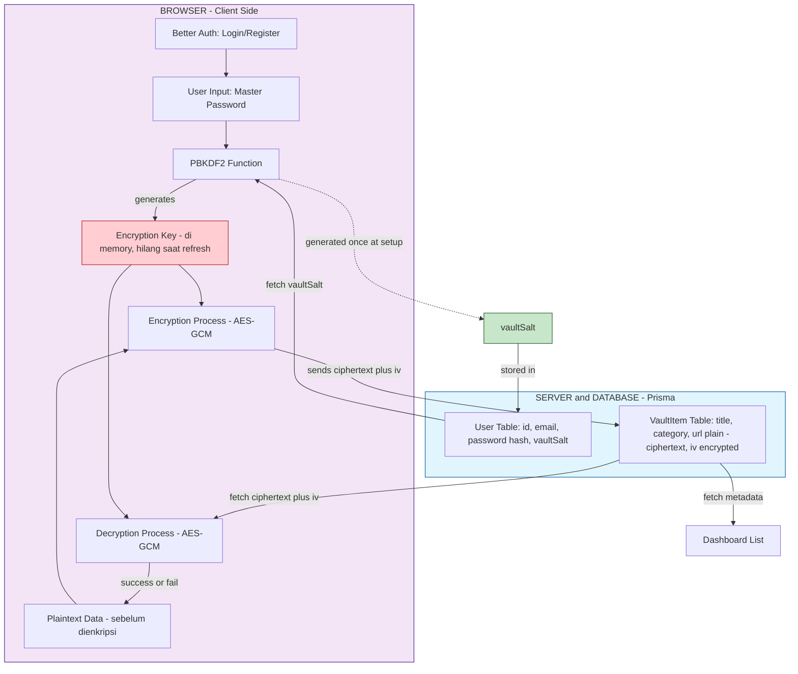

# 🔐 Centinela

**Centinela** adalah password manager **zero-knowledge** yang dibangun dengan Next.js. Nama "Centinela" (bahasa Spanyol: _penjaga/sentry_) mencerminkan fungsi utamanya — menjaga rahasia kamu tanpa pernah melihat isinya sendiri.

> **Zero-knowledge** berarti: server (dan siapa pun yang punya akses ke database) **tidak pernah** bisa melihat data asli kamu — username, password, catatan — karena semuanya dienkripsi di browser **sebelum** dikirim ke server. Bahkan developer aplikasi ini sendiri tidak bisa membukanya tanpa Master Password kamu.

---

## ✨ Fitur Utama

- 🔑 **End-to-end encryption** — data dienkripsi/didekripsi sepenuhnya di client (browser), menggunakan **AES-256-GCM**
- 🧂 **Key derivation aman** — Master Password diubah jadi Encryption Key lewat **PBKDF2-SHA256** (600.000 iterasi, sesuai rekomendasi OWASP 2024+)
- 🚫 **Master Password tidak pernah dikirim ke server** — hanya digunakan untuk derive key di browser
- 🧠 **Encryption Key hanya hidup di memory** — otomatis hilang saat refresh halaman, memaksa re-derive dari Master Password
- 🔒 **Autentikasi terpisah** — login/register dikelola oleh [Better Auth](https://www.better-auth.com/), independen dari sistem enkripsi vault
- ✅ **Integritas data terjamin** — AES-GCM punya _authentication tag_ built-in, otomatis mendeteksi password salah atau data yang di-tamper

---

## 🏗️ Arsitektur



### Alur singkat

1. **Setup awal** — User register lewat Better Auth → set Master Password → `vaultSalt` random di-generate sekali → Master Password + `vaultSalt` di-derive lewat PBKDF2 jadi **Encryption Key (EK)**
2. **Unlock vault** — Setiap kali buka app / refresh, user input Master Password lagi → `vaultSalt` diambil dari server → EK di-derive ulang (server tidak pernah menyimpan EK)
3. **Simpan item** — Data sensitif (username, password, notes) digabung jadi JSON → dienkripsi pakai EK + AES-GCM → hanya `ciphertext` + `iv` yang dikirim & disimpan di server
4. **Buka item** — `ciphertext` + `iv` diambil dari server → didekripsi di client pakai EK → jika Master Password salah, dekripsi otomatis gagal (authentication tag mismatch)

---

## 🧰 Tech Stack

| Layer                | Teknologi                                             |
| -------------------- | ----------------------------------------------------- |
| Framework            | [Next.js](https://nextjs.org/) (App Router)           |
| Bahasa               | TypeScript                                            |
| Autentikasi          | [Better Auth](https://www.better-auth.com/)           |
| ORM / Database       | [Prisma](https://www.prisma.io/) + PostgreSQL         |
| Enkripsi             | Web Crypto API (`PBKDF2`, `AES-GCM`)                  |
| Form                 | [TanStack Form](https://tanstack.com/form)            |
| Validasi             | [Zod](https://zod.dev/)                               |
| UI Components        | [shadcn/ui](https://ui.shadcn.com/) + Tailwind CSS v4 |
| Email                | -                                                     |
| Linting / Formatting | ESLint, Prettier, Husky (pre-commit/pre-push hooks)   |

---

## 🔬 Detail Kriptografi

### Key Derivation — PBKDF2-SHA256

```
Master Password + vaultSalt
        ↓  (600.000 iterasi HMAC-SHA256)
   Encryption Key (256-bit, non-extractable)
```

| Parameter              | Nilai             | Alasan                                                                          |
| ---------------------- | ----------------- | ------------------------------------------------------------------------------- |
| Iterasi                | 600.000           | Rekomendasi minimum OWASP untuk PBKDF2-SHA256 (2024+)                           |
| Hash function          | SHA-256           | Aman, native di Web Crypto API                                                  |
| Panjang Encryption Key | 256-bit           | AES-256, standar industri password manager                                      |
| Panjang `vaultSalt`    | 16 byte (128-bit) | Mencegah dua Master Password identik menghasilkan key sama                      |
| `extractable`          | `false`           | Key tidak bisa di-_export_ lagi setelah dibuat — mitigasi tambahan terhadap XSS |

### Enkripsi/Dekripsi — AES-256-GCM

| Parameter          | Nilai            | Alasan                                                                          |
| ------------------ | ---------------- | ------------------------------------------------------------------------------- |
| Mode               | GCM              | Punya _authentication tag_ bawaan — otomatis mendeteksi tampering / key salah   |
| Panjang `iv`       | 12 byte (96-bit) | Standar/optimal untuk AES-GCM, **wajib unik** tiap proses enkripsi              |
| `vaultSalt` & `iv` | Tidak rahasia    | Aman disimpan plain di database — fungsinya mencegah pola, bukan menyembunyikan |

> Implementasi lengkap ada di [`lib/crypto.ts`](./lib/crypto.ts).

---

## 🗄️ Database Schema

Ringkasan model utama (lihat [`prisma/schema.prisma`](./prisma/schema.prisma) untuk detail lengkap):

```prisma
model User {
  // ...field Better Auth lainnya
  vaultSalt  String?  // bukan rahasia, untuk re-derive Encryption Key
  vaultItems VaultItem[]
}

model VaultItem {
  id         String  @id @default(cuid())
  userId     String
  title      String  // plain — untuk list & search di dashboard
  category   String?
  url        String?
  ciphertext String  @db.Text // hasil enkripsi: username, password, notes
  iv         String  // initialization vector, unik tiap item
}
```

**Catatan desain:** `title`, `category`, dan `url` disimpan plain agar dashboard bisa menampilkan daftar vault item tanpa perlu mendekripsi semuanya terlebih dahulu. Data sensitif (username, password, notes) digabung jadi satu JSON lalu dienkripsi sebagai satu `ciphertext`.

---

## 🚀 Getting Started

```bash
# Install dependencies
npm install

# Setup environment variables
cp .env.example .env
# Isi DATABASE_URL, BETTER_AUTH_SECRET, RESEND_API_KEY, dll.

# Generate Prisma client & jalankan migration
npx prisma generate
npx prisma migrate dev

# Jalankan development server
npm run dev
```

Buka [http://localhost:3000](http://localhost:3000) di browser.

---

## ⚠️ Catatan Keamanan

- **Master Password tidak bisa direset** jika lupa. Karena server tidak pernah menyimpannya (bahkan dalam bentuk hash), tidak ada mekanisme "forgot password" untuk Master Password — ini adalah konsekuensi yang melekat pada desain zero-knowledge, bukan kekurangan fitur.
- Project ini dibuat untuk tujuan pembelajaran/portofolio. Untuk skenario produksi, pertimbangkan audit keamanan independen sebelum digunakan menyimpan data sensitif yang sesungguhnya.

---

## 📄 Lisensi

MIT
